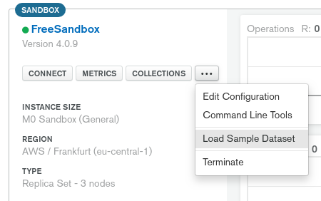

# MongoDB Atlas & MongoDB Stitch Hackathon

## Objectives

In this hackathon, you will discover more about MongoDB Atlas, the DBaaS by MongoDB and MongoDB Stitch, the serverless platform
which can be used to build different things like a REST API on top of your MongoDB clusters, interconnect MongoDB with AWS or
Twilio services for example, host a frontend or build a mobile application while enforcing security rules. 

## Let's do it

### MongoDB Atlas

First, you will need to create a [MongoDB ReplicaSet](https://docs.mongodb.com/manual/replication/) using MongoDB Atlas.

 - Go to https://www.mongodb.com/meetatlas and setup a new MongoDB Atlas account.
 - Follow the *Build a New Cluster* form and create a MongoDB Free Tier cluster (M0) which is free forever.
 - An M0 cluster has 512MB of storage and runs on our shared infrastructure designed for non-production workloads.
 - Wait for a few minutes for the cluster to be ready to use.
 - Meanwhile, have a look to the tabs on the left: 
    - Alerts,
    - Backup,
    - Access,
    - Settings.
 - When your cluster is ready, load the sample dataset using the menu.
 

 
 - Familiarize yourself with the different tabs in your cluster:
    - Connect - where you can get the MongoDB URI to connect with the command line, your application, MongoDB Compass or the BI
    Connector.
    - Real Time - where you can see what's happening right now on your cluster,
    - Metrics - where you can explore all the metrics history,
    - Collections - where you can browse your collections and manipulate the data, 
    - Command Line Tools - where you can copy/paste the command lines to use MongoDB import/export/dump/restore/top/stats.

> NB: Because you are currently loading the sample dataset, you should see some writes in the *Real Time* and *Metrics* tabs. 

 - You are now ready to work with your new cluster.
 - In order to do that, you will need to complete 2 actions in the *Security* tab at the top: 
   - Create a MongoDB User for your cluster because the authentication is ON of course!
   - Whitelist your public IP address because we are in the cloud and it's not an open bar for hackers!
 
 
 
 - To verify that you have correctly setup the MongoDB User and your IP address, try to connect with MongoDB Compass using the 
 *Connect* button and follow the instructions.
 
### MongoDB Compass
 
 - Explore MongoDB Compass & visit the different tabs.
 
#### Lab 1
 
 - Build a geo spatial query on the `sample_geospatial.shipwrecks` database using the map you will find in the *Schema* tab.
 - How many wrecks are within 10km of the Statue of Liberty?
 - Clue : The radius unit is radian. Find a way to transform 10km in radian [here](https://docs.mongodb.com/manual/tutorial/calculate-distances-using-spherical-geometry-with-2d-geospatial-indexes/).
 
<details><summary>Click to see the answer</summary><p>
  The answer is 66 :-).
</p></details>
 
#### Lab 2

 - Use now the `sample_training.zips` collection.
 - Have a look to its content.
 - MongoDB uses the Aggregation Framework to manipulate data. 
 - Here is an example of an aggregation pipeline which finds the 3 most inhabited states in the USA.

```js
[
  {
    '$group': {
      '_id': '$state', 
      'totalPop': {
        '$sum': '$pop'
      }
    }
  }, {
    '$project': {
      'state': '$_id', 
      'totalPop': 1, 
      '_id': 0
    }
  }, {
    '$sort': {
      'totalPop': -1
    }
  }, {
    '$limit': 3
  }
]
```

 - Import this pipeline in MongoDB Compass using the import tool.
 - Can you change this pipeline to find the 5 biggest cities in the State of New York?

 <details><summary>Click to see the answer</summary>
 
```js
[
  {
    '$match': {
      'state': 'NY'
    }
  }, {
    '$group': {
      '_id': '$city', 
      'totalPop': {
        '$sum': '$pop'
      }
    }
  }, {
    '$project': {
      'city': '$_id', 
      'totalPop': 1, 
      '_id': 0
    }
  }, {
    '$sort': {
      'totalPop': -1
    }
  }, {
    '$limit': 5
  }
]
```
</details>

### MongoDB Stitch

MongoDB Stitch is the serverless platform you can use to build backend services on top of MongoDB Atlas.

Let's build our first mini application with MongoDB Stitch.

#### Lab: Create a Stitch Application


#### Lab: Create a REST API

First, we want to create a simple REST API to read and write movie titles to MongoDB.